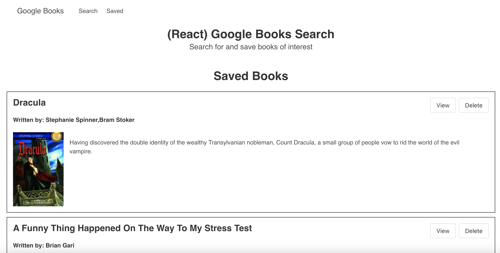

# HW 20 Google Books Search
For this assignment, which was to create a web app that finds and saves books for the user, we used:
-React
-Express
-MongoDB
-Googlebooks API

# Screenshots

# Links
Github: https://github.com/charlispilecki/HW_20_Google_Books_Search
Heroku: https://google-books-search-1736145.herokuapp.com/
